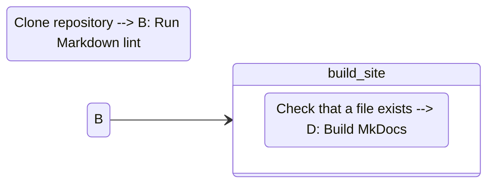

# CI showdown

Continuous Integration/Continuous Deployment (CI/CD) pipelines have become an integral development tool for automating tedious tasks--from tests, to repository maintenance, to releases.

There are a number of CI/CD tools on the market, but today we'll be covering 3:

- GitHub Actions
- Gitlab CI/CD
- Tekton

!!! note

    For the purposes of this article, unless otherwise specified, the terms "workflow" and "pipeline" will be used interchangeably. "CI/CD" is colloquially abbreviated to "CI".

## What is a CI pipeline?

For those of you new to CI pipelines it's important to understand what they are, the main components, and how/why they're triggered.

### Pipeline components

While each different CI has unique features & idiosyncrasies, most consist of the same main components.

#### Trigger

What starts the pipeline. This can be manually triggered by a user or automatically on a schedule, a webhook, a git commit, etc.

#### Jobs

Sometimes also called "tasks", these are individual operations that usually accomplish a single task. That could be running static analysis or unit tests, linting, building a project, interacting with another service, etc. A job usually runs in a single container.

#### Steps

Jobs can often be broken down into smaller steps. While each job can use a different container image, steps usually (not always) all run in the same container. Jobs frequently only use a single step, but breaking up into multiple steps can help clarify to the user what's happening. Steps also allow you to include different configurations/environment variables that may not be necessary for the whole job.

#### Container image

As mentioned [above](#jobs), each time a pipeline runs a job, it starts a container image in which to run the job--this is a critical aspect of CI pipelines. The flexibility of containers is what allows developers to accomplish a variety of tasks without the need for managing the litany of dependencies.

## Comparing the tools

Lets examine a few of the available CI tools:

| Tool | Hosted on | Pros | Cons |
| --- | --- | --- | --- |
| [Github Actions](https://github.com/features/actions) | All Github plans | <ul><li>Simple</li></ul> | <ul></ul> |
| [Gitlab CI](https://docs.gitlab.com/ee/ci/) | All Gitlab tiers | <ul><li>Simple</li></ul> | <ul>Requires a [runner](https://docs.gitlab.com/runner/)</ul> |
| [Tekton](https://tekton.dev/) | Kubernetes | <ul><li>More configurable</li><li>By being hosted in Kubernetes, no server is required</li></ul> | <ul><li>Requires more configuration</li></ul> |

Now let's see what a simple pipeline would look like using each CI:

=== "Github Actions"

    ```yaml
    name: build-mkdocs
    on:
      push:
        branches:
          - main
    jobs:
      lint:
        container: markdownlint/markdownlint
        runs-on: ubuntu-latest
        steps:
          - uses: actions/checkout@v4
          - name: Run Markdown lint
            run: mdl
      build_site:
        needs: [lint]
        container: squidfunk/mkdocs-material
        runs-on: ubuntu-latest
        steps:
          - uses: actions/checkout@v4
          - name: Check for document
            run: |
              if [[ -f docs/myDoc.md ]]; then
                echo "myDoc.md exists!"
              fi
          - name: Build site
            run: mkdocs build
    ```

=== "Gitlab CI/CD"

    ```yaml
    workflow:
      name: build-mkdocs
      rules:
        - if: $CI_COMMIT_BRANCH == 'main'
    lint:
      image: markdownlint/markdownlint
      script: mdl
    build_site:
      needs: ["lint"]
      image: squidfunk/mkdocs-material
      run:
        - name: Check for document
          script: |
            if [[ -f docs/myDoc.md ]]; then
              echo "myDoc.md exists!"
            fi
        - name: Build site
          script: mkdoc build
    ```

=== "Tekton"

    ```yaml
    apiVersion: tekton.dev/v1beta1
    kind: Pipeline
    metadata:
      name: build-mkdocs
    spec:
      params:
        - name: url
      workspaces:
        - name: repo
      tasks:
        - name: Clone repository
          taskRef:
            name: git-clone
            kind: ClusterTask
          params:
            - name: url
              value: $(params.url)
          workspaces:
            - name: output
              workspace: repo
        - name: lint
          workspaces:
            - name: repo
              workspace: repo
          taskSpec:
            workspaces:
              - name: repo
            steps:
              - name: Run Markdown lint
                image: markdownlint/markdownlint
                workingDir: $(workspaces.repo.path)
                script: mdl
        - name: build_site
          workspaces:
            - name: repo
              workspace: repo
          taskSpec:
            workspaces:
              - name: repo
            stepTemplate:
              workingDir: $(workspaces.repo.path)
            steps:
              - name: Check for document
                script: |
                  if [[ -f docs/myDoc.md ]]; then
                    echo "myDoc.md exists!"
                  fi
              - name: Build site
                image: squidfunk/mkdocs-material
                script: mkdocs build
    ```

The pipeline accomplishes the following: 




<div hidden>

#### AI

# ChatGPT

### Comparing GitHub Actions, GitLab CI, and Tekton: Similarities, Differences, Pros, and Cons

Continuous Integration (CI) tools play a critical role in modern software development by automating code integration, testing, and deployment processes. GitHub Actions, GitLab CI, and Tekton are three popular CI tools that cater to various workflows. This article explores their similarities, differences, and the advantages and disadvantages of each.

---

### **Similarities**

1. **Automation of CI/CD Pipelines**
   All three tools support creating, managing, and automating CI/CD pipelines for tasks like building, testing, and deploying code.

2. **Integration with Source Code Management (SCM)**
   - GitHub Actions integrates seamlessly with GitHub repositories.
   - GitLab CI is a native feature of GitLab.
   - Tekton, while independent of a specific SCM, integrates well with Git-based workflows.

3. **Support for Containerized Workflows**
   They all support containerized environments using Docker images, enabling scalable, consistent builds and deployments.

4. **Extensibility**
   These tools offer extensions or plugins:
   - GitHub Actions has a vast marketplace.
   - GitLab CI supports custom scripts and integrations.
   - Tekton allows building custom reusable tasks.

---

### **Differences**

| Feature                | GitHub Actions                   | GitLab CI                       | Tekton                             |
|------------------------|----------------------------------|---------------------------------|------------------------------------|
| **Hosting**            | GitHub-hosted and self-hosted runners | GitLab-hosted and self-managed runners | Fully self-hosted                  |
| **Ease of Use**        | Simple YAML-based workflow files | YAML files with tighter GitLab integration | Advanced configuration via Kubernetes CRDs |
| **Platform Dependency**| Tied to GitHub repositories      | Tied to GitLab repositories     | Repository-agnostic                |
| **Pricing**            | Free for public repos, limited free tier for private repos | Free tier available, with more features in paid plans | Open-source and free, but requires infrastructure |
| **Pipeline Orchestration** | Direct YAML configuration       | Built-in integration with GitLab | Kubernetes-native orchestration    |
| **Scalability**        | Limited to GitHub’s infrastructure for hosted runners | Scales within GitLab ecosystem   | Kubernetes’ inherent scalability   |

---

### **Pros and Cons**

#### **GitHub Actions**
**Pros**
- Seamless GitHub integration for repository management.
- Large marketplace with prebuilt actions.
- User-friendly YAML configuration for workflows.
- Hosted runners reduce setup effort.

**Cons**
- Tied to GitHub repositories, limiting flexibility.
- Hosted runners may have resource limitations for large-scale projects.
- Limited free tier for private repositories.

#### **GitLab CI**
**Pros**
- Native to GitLab, providing streamlined integration with its SCM and DevOps features.
- Flexible runner options (hosted and self-managed).
- Advanced features like security scanning and monitoring in higher-tier plans.

**Cons**
- Free tier offers fewer compute minutes compared to GitHub Actions.
- Requires GitLab as the SCM, reducing flexibility for teams using other platforms.

#### **Tekton**
**Pros**
- Kubernetes-native, enabling scalable and cloud-native pipeline orchestration.
- Repository-agnostic, supporting a wide variety of use cases.
- Highly customizable and extensible.

**Cons**
- Steeper learning curve due to Kubernetes-focused setup.
- Requires infrastructure management and Kubernetes expertise.
- Limited community resources compared to GitHub Actions and GitLab CI.

---

### **Which Should You Choose?**

- **Choose GitHub Actions** if your projects are hosted on GitHub and you need a simple, integrated CI/CD tool with minimal setup.
- **Choose GitLab CI** if your team uses GitLab as an all-in-one DevOps platform and requires native features like issue tracking and security scans.
- **Choose Tekton** if you are looking for a Kubernetes-native, highly scalable, and flexible CI/CD solution for advanced workflows and multi-cloud environments.

Each of these tools serves a distinct audience, so the best choice depends on your specific requirements, technical expertise, and ecosystem preferences.

# Copilot

I apologize for any inconvenience. Let me provide you with a comprehensive comparison of GitHub Actions, GitLab CI, and Tekton, covering their similarities, differences, pros, and cons.

### GitHub Actions
**Similarities:**
- **Automation**: Automates software workflows, similar to GitLab CI and Tekton.
- **Integration**: Integrates seamlessly with GitHub repositories.
- **Extensibility**: Supports custom actions and a marketplace for sharing actions.

**Differences:**
- **Ease of Use**: Intuitive interface directly within GitHub.
- **Community**: Large community and marketplace for pre-built actions.
- **Pricing**: Offers generous free tier for open-source projects.

**Pros:**
- **Seamless GitHub Integration**: Directly tied to GitHub, making setup easy for GitHub users.
- **Marketplace**: Rich ecosystem of actions created by the community.
- **Flexibility**: Supports various triggers and custom workflows.

**Cons:**
- **Limited Outside GitHub**: Best suited for GitHub repositories, less integration with other platforms.
- **Complexity for Large Projects**: May require more setup for complex workflows.

### GitLab CI
**Similarities:**
- **CI/CD Pipelines**: Automates the build, test, and deployment process.
- **Integration**: Built-in with GitLab repositories, like GitHub Actions with GitHub.
- **Flexibility**: Supports various programming languages and platforms.

**Differences:**
- **Complete DevOps Solution**: Provides a full suite of DevOps tools (issue tracking, container registry, etc.).
- **Docker Integration**: Strong native support for Docker.
- **Self-Hosting**: Can be self-hosted on your infrastructure.

**Pros:**
- **Comprehensive Toolset**: All-in-one DevOps platform with integrated features.
- **Flexibility**: Easily configurable and supports complex workflows.
- **Free for Self-Hosting**: Cost-effective for private projects on self-hosted servers.

**Cons:**
- **Resource Intensive**: Self-hosting requires significant resources and maintenance.
- **Steeper Learning Curve**: May require more time to master all features.

### Tekton
**Similarities:**
- **Kubernetes-Native**: CI/CD pipelines designed to run on Kubernetes, like GitHub Actions and GitLab CI can integrate with Kubernetes.
- **Extensibility**: Highly extensible and modular.

**Differences:**
- **Flexibility**: Designed as a flexible, Kubernetes-native framework.
- **Vendor-Neutral**: Does not tie to a specific version control system or CI/CD platform.
- **Custom Resources**: Uses Kubernetes Custom Resource Definitions (CRDs).

**Pros:**
- **Kubernetes Integration**: Perfect for cloud-native applications and Kubernetes clusters.
- **Modularity**: Highly modular, allowing for custom pipeline components.
- **Vendor-Agnostic**: Flexible and can be used with various platforms.

**Cons:**
- **Complexity**: Requires a good understanding of Kubernetes and CRDs.
- **Setup Time**: Initial setup can be time-consuming compared to more integrated solutions.

### Conclusion
Choosing between GitHub Actions, GitLab CI, and Tekton depends on your specific needs and existing infrastructure:

- **GitHub Actions**: Ideal for GitHub users looking for an easy-to-use, integrated CI/CD solution with a large marketplace.
- **GitLab CI**: Best for teams seeking a comprehensive DevOps platform with robust features and self-hosting capabilities.
- **Tekton**: Suited for advanced users who need a flexible, Kubernetes-native CI/CD solution with modular components.

I hope this provides a clear comparison and helps you decide which tool fits your needs best! If you need any further details or have specific questions, feel free to ask.

# perplexity

Write an article comparing the similarities, differences, pros, and cons of the following CI tools: GitHub actions, Gitlab ci, and tekton

### Comparison of GitHub Actions, GitLab CI, and Tekton

#### **Similarities**
- **CI/CD Automation**: All three tools enable automation of build, test, and deployment processes using YAML configurations[2][5].
- **Scalability**: GitLab CI and Tekton excel in container-based scalability, while GitHub Actions scales with cloud infrastructure[4].
- **Integration**: GitHub Actions integrates tightly with GitHub, GitLab CI with the GitLab ecosystem, and Tekton with Kubernetes environments[1][4].

#### **Differences**
| Feature              | GitHub Actions                     | GitLab CI                      | Tekton                          |
|----------------------|-------------------------------------|--------------------------------|---------------------------------|
| **Ease of Use**      | Simple for GitHub users         | Intuitive UI, supports runners | Steep learning curve        |
| **Pricing**          | Usage-based                    | Free for self-hosted setups | Open-source and free        |
| **Modularity**       | Limited customization           | Moderate flexibility       | Highly modular/customizable |
| **Target Audience**  | GitHub-centric teams            | Comprehensive DevOps teams  | Kubernetes-native workflows |

#### **Pros**
- **GitHub Actions**: Seamless integration with GitHub, vast marketplace for pre-built actions, event-driven workflows[2][8].
- **GitLab CI**: Advanced pipeline features (e.g., multi-stage workflows), built-in DevOps tools like container registry[4][12].
- **Tekton**: Kubernetes-native design, extreme configurability, reusable components for custom pipelines[1][6].

#### **Cons**
- **GitHub Actions**: Tied to GitHub ecosystem; costs can rise with heavy usage[9].
- **GitLab CI**: Requires setup for non-GitLab environments; fewer third-party integrations[2][12].
- **Tekton**: Complex setup; frequent API changes; lacks built-in dashboards without additional configuration[6][11].

#### **Conclusion**
- Use **GitHub Actions** for simplicity and GitHub-centric projects.
- Opt for **GitLab CI** for a full-featured DevOps platform.
- Choose **Tekton** if you need Kubernetes-native pipelines with high customization.

Citations:
[1] GitHub Actions vs Tekton comparison - PeerSpot https://www.peerspot.com/products/comparisons/github-actions_vs_tekton
[2] GitHub Actions vs GitLab CI/CD: Key Differences Explained https://startup-house.com/blog/github-actions-vs-gitlab-ci-cd-key-differences
[3] Continuous Integration Tools for DevOps - Jenkins vs. GitLab CI vs ... https://attractgroup.com/blog/continuous-integration-tools-for-devops-jenkins-vs-gitlab-ci-vs-github-action/
[4] GitHub Actions vs Bitbucket Pipelines vs GitLab CI vs Tekton - Stakater https://www.stakater.com/post/github-actions-vs-bitbucket-pipelines-vs-gitlab-ci-vs-tekton-bestcicdtool
[5] Migrating from GitHub Actions - GitLab Documentation https://docs.gitlab.com/ee/ci/migration/github_actions.html
[6] Tekton vs Jenkins: Head-to-head comparison - Stakater https://www.stakater.com/post/tekton-vs-jenkins-head-to-head-comparison
[7] Gitlab CI vs Jenkins vs GitHub Actions : r/devops - Reddit https://www.reddit.com/r/devops/comments/105a2bn/gitlab_ci_vs_jenkins_vs_github_actions/
[8] GitHub Actions Vs. GitLab CI - Nira https://nira.com/github-actions-vs-gitlab-ci/
[9] What are the differences between GitHub Actions and other CI tools ... https://stackoverflow.com/questions/52953357/what-are-the-differences-between-github-actions-and-other-ci-tools-like-jenkins
[10] GitHub Actions vs GitLab Comparison 2025 - PeerSpot https://www.peerspot.com/products/comparisons/github-actions_vs_gitlab
[11] Tekton CI, part I, a gentle introduction - DEV Community https://dev.to/leandronsp/tekton-ci-part-i-a-gentle-introduction-ilj
[12] GitLab CI/CD vs. GitHub Actions - Graphite.dev https://graphite.dev/guides/gitlab-cicd--vs-github-actions

# Claude

# A Comparison of Modern CI/CD Tools

## Introduction
Continuous Integration (CI) tools have become essential in modern software development. This article compares three popular options: GitHub Actions, GitLab CI, and Tekton, examining their key features, strengths, and limitations.

## GitHub Actions

### Overview
GitHub Actions is GitHub's native CI/CD solution, tightly integrated with GitHub repositories.

### Pros
- Native integration with GitHub repositories
- Large marketplace of pre-built actions
- Free for public repositories
- Simple learning curve
- Excellent documentation
- Works well with most cloud providers
- Easy setup and configuration

### Cons
- Limited self-hosted runner management options
- Can become expensive for heavy private repository usage
- Dependent on GitHub ecosystem
- Limited customization compared to alternatives

### Key Features
- YAML-based workflow configuration
- Matrix builds support
- Built-in secret management
- Reusable workflows and composite actions
- Automated container publishing
- Event-driven workflows

## GitLab CI

### Overview
GitLab CI is part of GitLab's complete DevOps platform, offering end-to-end development tools.

### Pros
- Complete DevOps platform integration
- Built-in container registry
- Advanced pipeline visualization
- Strong security scanning features
- Excellent documentation
- Flexible deployment options
- Powerful caching mechanisms

### Cons
- Can be resource-intensive
- More complex setup compared to GitHub Actions
- Higher learning curve
- Can be expensive at scale

### Key Features
- Auto DevOps capabilities
- Built-in security scanning
- Container scanning
- Dependency scanning
- Advanced pipeline scheduling
- Multiple deployment targets
- Environment management

## Tekton

### Overview
Tekton is a Kubernetes-native CI/CD solution, focusing on creating reusable, modular components.

### Pros
- Cloud-native architecture
- Highly scalable
- Extremely flexible and customizable
- Vendor-neutral
- Strong community backing
- Great for microservices
- Excellent resource utilization

### Cons
- Steep learning curve
- Requires Kubernetes expertise
- Complex initial setup
- Less mature ecosystem
- Fewer pre-built components

### Key Features
- Custom resource definitions (CRDs)
- Pipeline as code
- Reusable task definitions
- Native Kubernetes integration
- Modular architecture
- Extensible through custom tasks

## Use Case Comparison

### GitHub Actions is Best For:
- Small to medium-sized teams
- Open source projects
- Teams already using GitHub
- Projects needing quick setup
- Basic to moderate CI/CD requirements

### GitLab CI is Best For:
- Enterprise organizations
- Teams needing complete DevOps solutions
- Projects requiring advanced security features
- Complex pipeline requirements
- Teams wanting integrated tools

### Tekton is Best For:
- Kubernetes-native applications
- Microservices architectures
- Large-scale deployments
- Teams with strong Kubernetes expertise
- Organizations requiring maximum flexibility

## Configuration Examples

### GitHub Actions
```yaml
name: CI
on: [push]
jobs:
  build:
    runs-on: ubuntu-latest
    steps:
      - uses: actions/checkout@v2
      - name: Build
        run: |
          npm install
          npm run build
```

### GitLab CI
```yaml
stages:
  - build
  - test

build:
  stage: build
  script:
    - npm install
    - npm run build

test:
  stage: test
  script:
    - npm run test
```

### Tekton
```yaml
apiVersion: tekton.dev/v1beta1
kind: Task
metadata:
  name: build-app
spec:
  steps:
    - name: build
      image: node:14
      script: |
        npm install
        npm run build
```

## Cost Structure

### GitHub Actions
- Free tier: 2,000 minutes/month for public repos
- Pay-per-minute for private repos
- Self-hosted runners available
- Matrix pricing based on usage

### GitLab CI
- Free tier available
- Premium features require subscription
- Self-hosted option available
- Usage-based pricing for GitLab.com

### Tekton
- Open-source and free
- Costs primarily from:
  - Kubernetes infrastructure
  - Operational overhead
  - Training and maintenance

## Integration Capabilities

### GitHub Actions
- Excellent GitHub ecosystem integration
- Large marketplace
- Good cloud provider support
- Basic external tool integration

### GitLab CI
- Complete DevOps platform integration
- Built-in container registry
- Comprehensive API
- Strong security tools integration

### Tekton
- Native Kubernetes integration
- Flexible source control integration
- Cloud-native tool integration
- Custom resource extension support

## Conclusion

The choice between these tools depends on several factors:

- **GitHub Actions** is ideal for teams already using GitHub who need a simple, effective CI solution with minimal setup.
- **GitLab CI** suits organizations needing a complete DevOps platform with strong security features and integrated tools.
- **Tekton** is perfect for teams building cloud-native applications on Kubernetes who need maximum flexibility and scalability.

Consider your team's expertise, existing infrastructure, scaling requirements, and budget when making your decision.
</div>
