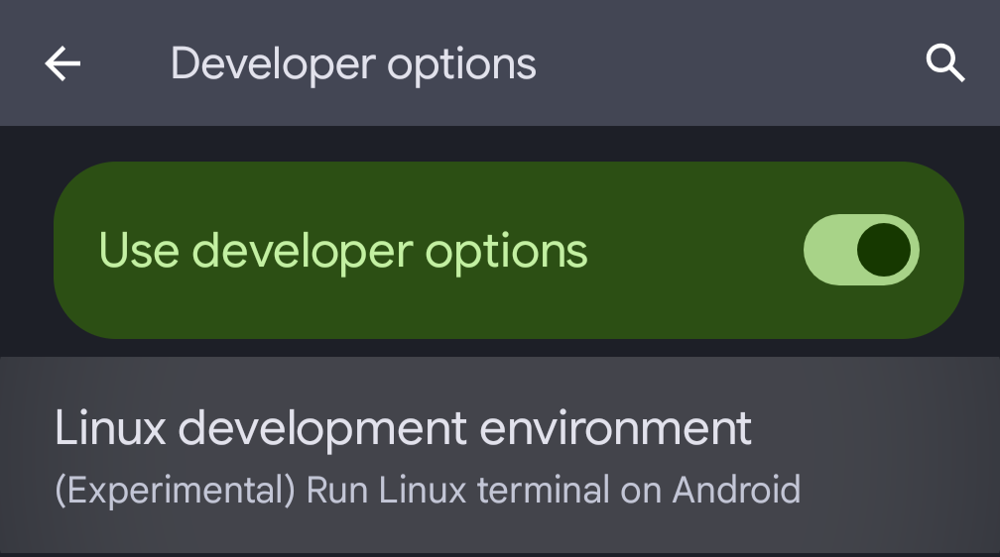
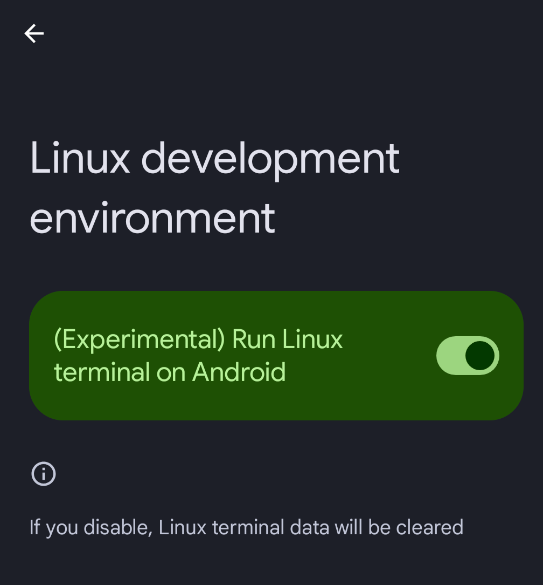
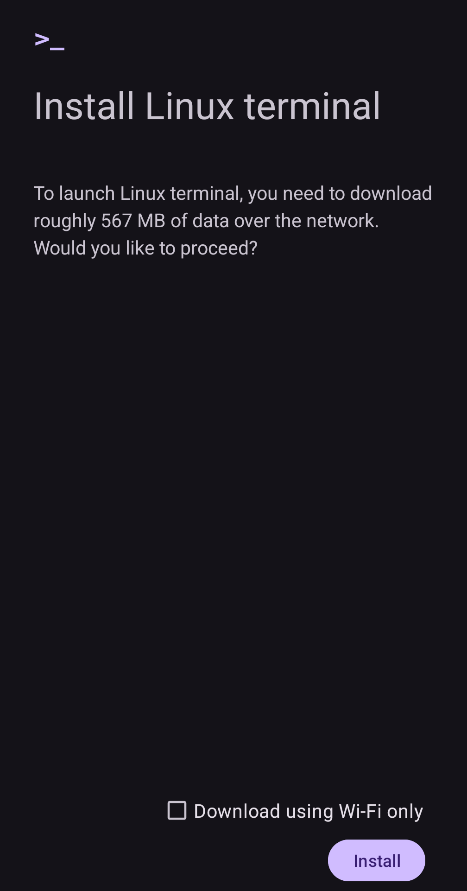
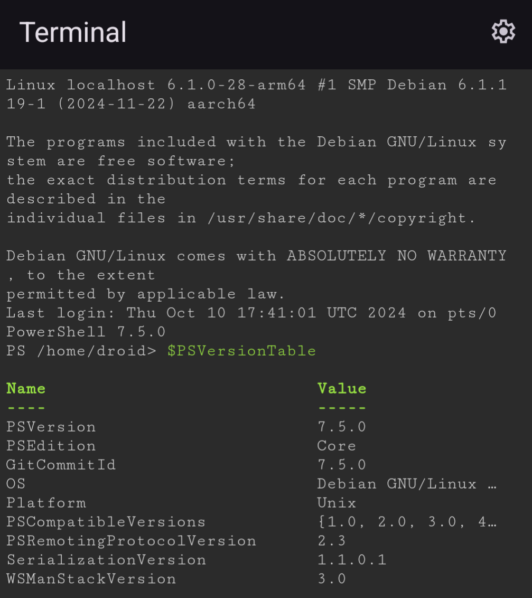
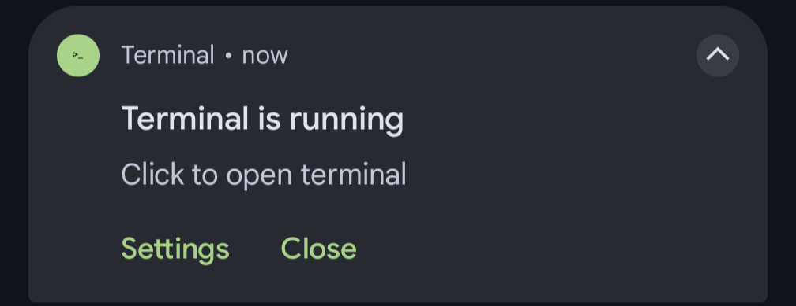
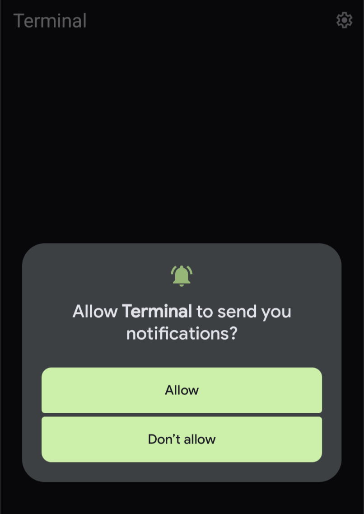
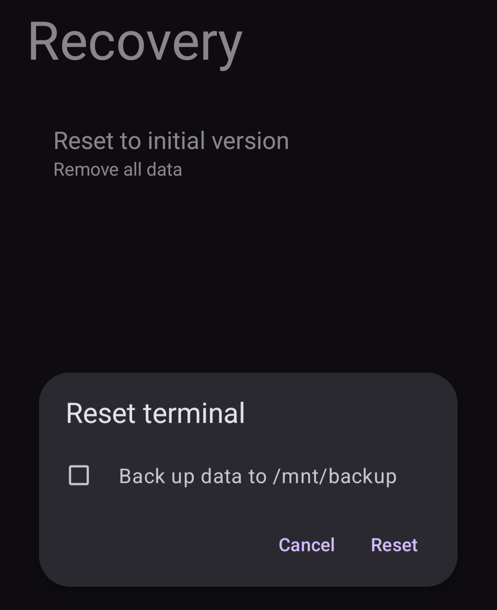

## Overview

A recent [update](https://www.zdnet.com/article/your-android-phone-will-run-debian-linux-soon-like-some-pixels-already-can/) to Android OS enables running a Debian Linux distribution on an Android phone. With a workable Linux distribution available on mobile, we now have the ability to install and run PowerShell in this Linux environment.

## Prerequisites

**Google Pixel**: The Linux terminal feature is still very new so Google Pixels are currently the only phones receiving the update. As with any other Android feature--non-Pixel Android phones will likely be receiving the update in the coming months.

**March 2025 software update**: The Linux terminal was included in the [March 2025](https://blog.google/products/pixel/pixel-drop-march-2025/) Pixel update, so make sure to install the latest software update.

## Procedures

### Enable the Linux terminal

The Linux terminal can be enabled from **Developer options**. If you don't have Developer options enabled, follow [these procedures](https://developer.android.com/studio/debug/dev-options#enable) to enable it.

Once enabled, navigate to **Settings** > **System** > **Developer options**. If you've received the latest update, you'll see the **Linux development environment** option under the Debugging section. Under this option, enable **(Experimental) Run Linux terminal on Android**.

{ width="300" }

{ width="300" }

### Install Linux terminal

Once the **Linux development environment** is enabled, open your app drawer and open the **Terminal** app--you'll see "Install Linux terminal". In the corner of the screen, click **Install**. The install will take a few minutes.

{ width="300" }

### Install PowerShell

The Google Pixel runs on an ARM64-based processor, so we'll follow [these procedures](https://learn.microsoft.com/en-us/powershell/scripting/install/install-other-linux#installation-using-a-binary-archive-file) for installing PowerShell as a binary archive, as opposed to from a package manager like [APT](https://en.wikipedia.org/wiki/APT_(software)). Simply copy the code from the procedures and paste into the terminal.

!!! info "Important"

    The example from the above procedures specifically references the `x64` edition of the PowerShell binary (e.g.: `powershell-7.5.0-linux-x64.tar.gz`). The correct binary for `arm64` processors is `powershell-7.5.0-linux-arm64.tar.gz`. The code below are the same procedures as provided by Microsoft, but for `arm64` instead of `x64`, which will be compatible with Google Pixel:

    ```shell
    curl -L -o /tmp/powershell.tar.gz https://github.com/PowerShell/PowerShell/releases/download/v7.5.0/powershell-7.5.0-linux-arm64.tar.gz
    sudo mkdir -p /opt/microsoft/powershell/7
    sudo tar zxf /tmp/powershell.tar.gz -C /opt/microsoft/powershell/7
    sudo chmod +x /opt/microsoft/powershell/7/pwsh
    sudo ln -s /opt/microsoft/powershell/7/pwsh /usr/bin/pwsh
    ```

That's all you need! Simply enter `pwsh` to run PowerShell on your Android.

{ width="300" }

### Set PowerShell as the default shell (Optional)

Bash is the default shell for this terminal, but you can change your default shell by running `chsh -s <shell binary> <username>`. The below example will set PowerShell as the default shell for our user (`droid`):

```shell
chsh -s /usr/bin/pwsh droid
```

### Copy/paste

To skip all the explanitory information and simply install PowerShell, copy the following code into your Linux terminal:

```shell
curl -L -o /tmp/powershell.tar.gz https://github.com/PowerShell/PowerShell/releases/download/v7.5.0/powershell-7.5.0-linux-arm64.tar.gz

sudo mkdir -p /opt/microsoft/powershell/7

sudo tar zxf /tmp/powershell.tar.gz -C /opt/microsoft/powershell/7

sudo chmod +x /opt/microsoft/powershell/7/pwsh

sudo ln -s /opt/microsoft/powershell/7/pwsh /usr/bin/pwsh

sudo chsh -s /usr/bin/pwsh droid

pwsh
```

## Troubleshooting

The Linux feature is still in the experimental stage, and as such it can be pretty glitchy. Below are some tips to resolve any issues you may run into.

!!! tip "Enable notifications"

    The terminal displays a persistant notification while it's running.

    { width="300" }

    As a result--when notifications are disabled--the app tends to act up. Ensuring notifications are enabled avoids some of these issues.

    { width="300" }

!!! tip "Pause the app"

    If the app is not responding or is acting erratically, I've found that pausing the app can resolve some issues. Press and hold on the app icon and select **Pause app**. Then open the app again and when prompted, select **Unpause app**.

!!! tip "Recovery"

    If the app is still not acting properly or keeps crashing, you can reset the app's data by clicking the settings "gear" icon in the upper right corner, navigate to **Recovery** > **Reset to initial version**, and click **Reset**.

    { width="300" }

    !!! warning

        This will delete all data related to the Linux environment on the phone.

!!! tip "Re-enable the Linux environment"

    There are times when the app is acting up so much that Recovery isn't even an option. In this case, simply disabling, then re-enabling the Linux environment via Developer options (as described [above](#enable-the-linux-terminal)) will reset the app.

    !!! warning

        As with the Recovery option, this will also delete all data related to the Linux environment on the phone.
